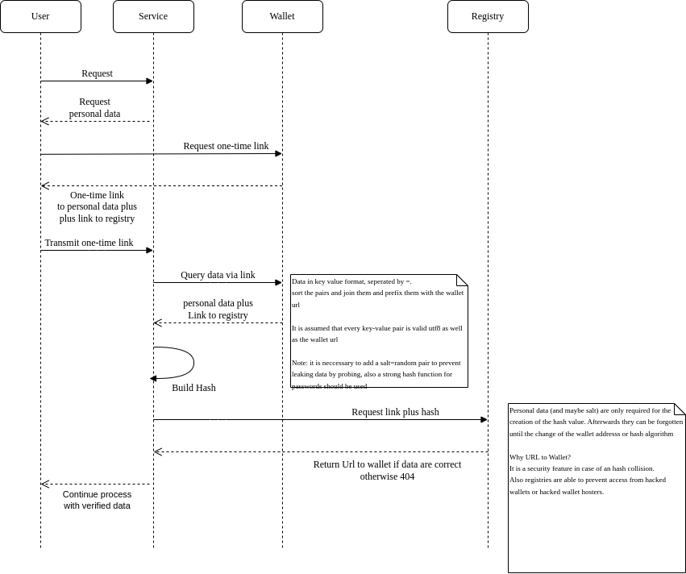

# Verification

## Lemmas

1. Every json object is a tree
2. Every tree can be broken down in a deterministic one dimensional key value list (proof: DFS,BFS, key and value can be joined by a special char which is forbidden in key (e.g. "=")). Key = the path down to the value 8the leaf)
3. Every RDF graph can be transformed via a DFS/BFS in a tree (non-deterministic)
   3.1 Every RDF graph without anonymous nodes (e.g. complex array elements) can be even simpler transformed into a uniqe and stable hash. see below
4. Every one dimensional, deterministic array can be sorted and afterwards be used for a unique, stable hash

## Verification

Secretgraph proposes the concept of partial trees for verification as a full tree would require all key-value pairs, from which some tree parts are maybe not shared for privacy reasons.
Instead of certain keys and corresponding values are extracted. We may need to add a key named salt with a random value which is also part of the hash to prevent extracting additional information by trying.

To build the hash, we put the key value pairs in a one dimensional array, sort it, prefix it with the address and use it for the unique hash.

## Draft concept

This is a stripped down variant of the draft:
ttps://gitlab.opencode.de/bmi/eidas2/-/issues/68

This is a stripped down international version which explains less trivials.

Note:

for performance reasons there is a new version. Instead of prefixing every key value pair, prefix the whole result with the url
