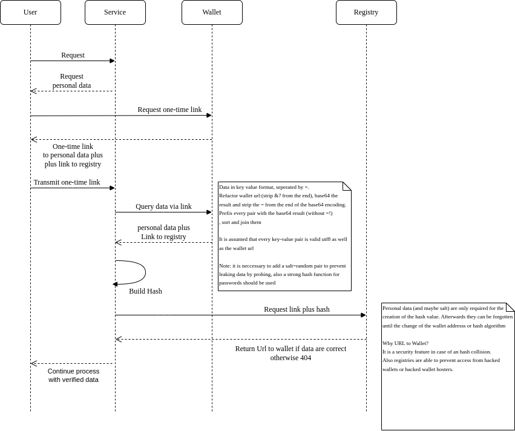

## Potential data verification workflow

Note: I submitted a draft also to: https://gitlab.opencode.de/bmi/eidas2/-/issues/68

This is a stripped down international version which explains less trivials.

